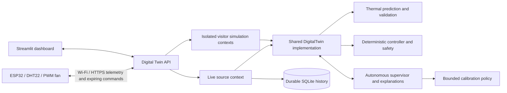

# Model-Based Smart Cooling Digital Twin

A portfolio-ready cyber-physical application with **Live Hardware** and **Simulation** modes, one shared Digital Twin core, a deterministic safety controller, thermal prediction and an autonomous supervisor. Visitors can try the complete demonstration without an ESP32 or an AI API key.

**Made by Maskini · © 2026 Maskini**

## Try it locally — Python 3.11+

```bash
python3.11 -m venv .venv
source .venv/bin/activate
pip install -e '.[dev]'
cp .env.example .env
python scripts/run_demo.py
```

Open [the dashboard](http://127.0.0.1:8501), choose **Simulation**, and click **Run Demo Scenario**. FastAPI runs on port 8000 and the dashboard on 8501. Ctrl-C stops both. [Interactive API documentation](http://127.0.0.1:8000/api/docs) is also available.

For separate processes:

```bash
python -m uvicorn smart_cooling_twin.api:app --host 127.0.0.1 --port 8000
streamlit run dashboard/app.py --server.address=127.0.0.1 --server.headless=true
```

## Two modes, one application

| | Simulation | Live Hardware |
|---|---|---|
| Data source | Thermal physical simulator | ESP32 over HTTPS, or optional LAN MQTT |
| Hardware required | No | ESP32, DHT22 and cooling fan |
| Visitor controls | Temperature, humidity, heat load, target, disturbances | Read-only view |
| Owner controls | Same deterministic controller | Authenticated AUTO/MANUAL and target settings |
| History | Isolated, bounded visitor session | Persistent SQLite hardware history |
| Offline behavior | Works independently of any physical device | Shows Offline and last update; safety fallback remains active |
| Model and agent | Shared core, prediction, validation, calibration and supervision | The same core and policies |

The mode selector switches the displayed source context. It does not reroute simulated commands to hardware. Every visitor gets a separate simulation session; one visitor's experiment cannot change another visitor's values or the live device.

### Simulation controls

Use **Start Simulation**, **Stop Simulation**, **Reset**, **Increase Temperature**, **Simulate Overheating**, and **Run Demo Scenario**. Edit temperature, humidity, heat load and target temperature in the sidebar. Advanced controls retain ambient temperature, fan effectiveness, sensor noise and sensor-failure injection. AUTO/MANUAL control remains available within the visitor's own session.

Stop freezes physics, history and telemetry timestamps. Reset affects only that visitor. Explicit temperature edits start a new measurement segment so intentional edits are not mistaken for sensor corruption. The dashboard shows measured/applied PWM, requested cooling, state transitions, charts, predictions, rolling MAE, model parameters, alerts, calibration outcomes and readable agent analysis.

### One-click guided scenario

1. Start around 27 °C in NORMAL with cooling off.
2. Apply a gradually acting thermal load.
3. Cross the normal cooling target and then the fixed 40 °C overheating threshold.
4. Detect OVERHEATING and enforce maximum cooling.
5. Remove the excessive heat load and improve available cooling.
6. Temperature falls toward the 30 °C target.
7. At or below 29 °C, hysteresis switches cooling off.

The run takes about a minute. Actual state transitions and scenario milestones appear in the UI. Physics generates the rising and falling measurements; the scenario does not directly set actuator commands or relax safety limits.

## Architecture



`SensorSource` is the adapter interface. `Esp32SensorSource`, `SimulationSensorSource`, and the optional `MqttSensorSource` all exchange the same validated `Telemetry` and `FanCommand` domain records with the same core. Transport callbacks and firmware-specific details do not contain application control decisions.

For Render, Nginx exposes the dashboard and `/api/*` through a single HTTPS address. Simulation remains usable while the physical device is off. The backend keeps live state in a separate `*.live.sqlite` database and leaves existing MQTT history intact.

## Model and validation

```text
dT/dt = k_heat + k_ambient * (T_ambient - T) - k_fan * fan_speed / 100
T_next = T + dt * dT/dt
```

Temperature is °C and time is seconds. Defaults are `k_heat=0.12 °C/s`, `k_ambient=0.012 /s` and `k_fan=0.25 °C/s`. Euler integration uses steps no longer than one second. The model is a deliberately simplified thermal approximation, not a high-fidelity thermodynamic simulator.

Each accepted measurement creates a two-second forecast. Later measurements within 0.5 seconds of its target are matched. Residual = measured − predicted; rolling MAE uses 30 absolute residuals. Missing samples are not treated as prediction errors.

Calibration uses at least 60 usable intervals and at least 15 percentage points of fan excitation. The first 70% of recent intervals fit the candidate; the final 30% validate it. A candidate must stay within physical parameter bounds and improve holdout MAE by at least 15%. The supervisor then checks 30 fresh intervals and rolls back unless improvement persists by at least 5%. Calibration cooldown, decisions, outcomes and alerts remain inspectable.

## Agent analysis and safety

The supervisor operates in both modes through OBSERVE → ASSESS → DECIDE → ACT → VERIFY → RECORD. It monitors connectivity, sensor health, temperature trends, actuator response, residual bias, model drift and recent actions. Human-readable explanations describe the actual controller decision and recommendations, for example why maximum cooling overrode manual demand.

| Condition | Deterministic behavior |
|---|---|
| NORMAL / HEATING / OFF in AUTO | Zero normal fan demand |
| COOLING in AUTO | `20 + 20 × (temperature − target)`, clamped to 0–100% |
| MANUAL | Requested demand, subject to safety |
| Temperature ≥40 °C or FAULT | 100% fallback overrides manual demand |
| Cooling exit | Target −1 °C hysteresis |
| Owner/visitor target | 20–35 °C |
| No valid device telemetry | Offline / FAULT after 10 seconds by default |
| Device receives no valid command | Local maximum cooling within five seconds |

The deterministic controller owns actuation. Neither the supervisor nor an LLM can issue raw PWM, publish arbitrary commands, modify the hard limit, or execute code. The existing LLM provider abstraction now has an optional HTTP diagnostic adapter. Set `LLM_ENABLED`, `LLM_API_URL`, `LLM_API_KEY` and `LLM_MODEL` only if using a service that implements the documented diagnostic contract. Without a key/provider, all simulation, hardware control and agent explanations work normally. External diagnostic output is schema-validated and has no actuator authority.

## Connect real hardware

Use `firmware/smart_cooling_http` for the Render/Internet path. Configure its ignored `config.h` with Wi-Fi credentials, the public HTTPS backend URL, matching `DEVICE_ID` and `HARDWARE_API_TOKEN`, and the trusted root CA. The ESP32 POSTs telemetry every two seconds and receives the latest expiring command in the response. A separate authenticated command-polling endpoint is also available. The firmware validates TLS, identity, numeric ranges, command time and expiry, and reconnects after failures.

The intended hardware is an ESP32, DHT22, logic-level MOSFET and 5 V fan, with a suitable motor power stage and common ground. GPIO 4 is the default sensor pin and GPIO 18 the PWM pin. Do not power a fan from a GPIO. Fan telemetry is applied PWM, not measured RPM. `servo_angle` is an optional telemetry field for future servo-equipped hardware; the supplied firmware operates the existing PWM fan.

See [firmware setup](firmware/README.md) and [HTTP/API contract](docs/HTTP_API.md). No board is needed to run or deploy the public simulation.

### Preserved MQTT compatibility

The original MQTT sketch and runtime remain available:

```bash
docker compose up -d
python -m simulator.physical_system
python -m smart_cooling_twin
```

Those commands run the legacy MQTT core. To use MQTT with the new dashboard, run the API with `HARDWARE_TRANSPORT=MQTT` instead of starting that standalone twin, or use:

```bash
python scripts/run_demo.py --local-broker --port 18883
```

Select Live Hardware to inspect the optional MQTT source. Visitor simulations remain independent. The latter command retains the earlier model-degradation disturbance demo. Never run two controller processes against the same device ID. [MQTT contract](docs/MQTT.md).

## Deployment and configuration

The Dockerfile, process supervisor, Nginx routing, health checks, persistent disk and Render blueprint are prepared. **Hosting has not been provisioned.** See [deployment instructions](docs/DEPLOYMENT.md) for the complete variable list and operating steps.

Public Simulation does not require a login. Hardware ingress uses `HARDWARE_API_TOKEN`; owner controls use a separate `ADMIN_API_TOKEN` and dashboard password. Empty tokens disable those hardware operations. `PUBLIC_DEMO=false` protects the dashboard and live API views for a private deployment. Secrets belong in environment variables and ignored firmware configuration, never Git.

## Tests

```bash
pytest -q
ruff check src simulator dashboard tests scripts
ruff format --check src simulator dashboard tests scripts
```

Tests cover model equations, state transitions, safety, real TCP MQTT recovery, authenticated HTTP telemetry and commands, stale/replayed readings, offline recovery, visitor isolation, paused simulation, reset, guided overheating recovery, persistence, calibration verification/rollback, optional AI validation and dashboard interactions. CI tests Python 3.11/3.12 and builds/starts the complete Docker deployment, then exercises its public API through Nginx.

## Repository map

```text
src/smart_cooling_twin/  Shared core, adapters, API, model, controller, agent and persistence
simulator/              Reusable physical thermal simulator and original MQTT runner
dashboard/              One portfolio dashboard for both modes
firmware/               HTTPS and original MQTT ESP32 sketches
scripts/                Local launcher, deployment supervisor and health checks
deployment/             Nginx configuration and container entrypoint
docs/                   Architecture, requirements, contracts, deployment and validation
data/                   Local runtime data (ignored)
```

## Limits and future work

This is an educational prototype, not a certified thermal safety system. The first-order model omits actuator lag, multiple thermal masses and nonlinear airflow. A constant cooling term can predict below ambient. Calibration depends on meaningful excitation and may reject data that mixes disturbances. A second ambient sensor, tachometer and hardware-in-the-loop commissioning are future improvements.

The default deployment uses one process/replica with bounded, disposable visitor sessions (16 concurrent, 15-minute idle timeout). Live history persists until archived by the operator. External AI diagnostics are opt-in and rate-limited; no external model is bundled. Physical wiring, sensor accuracy and motor behavior still require testing on the actual ESP32.

Original work is preserved in [the design README](docs/ORIGINAL_DESIGN.md) and [dashboard concept](docs/assets/dashboard-concept.jpg). See [requirements](docs/REQUIREMENTS.md), [architecture](docs/ARCHITECTURE.md), and [validation](docs/VALIDATION.md).
