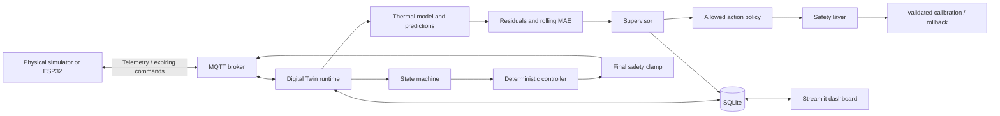
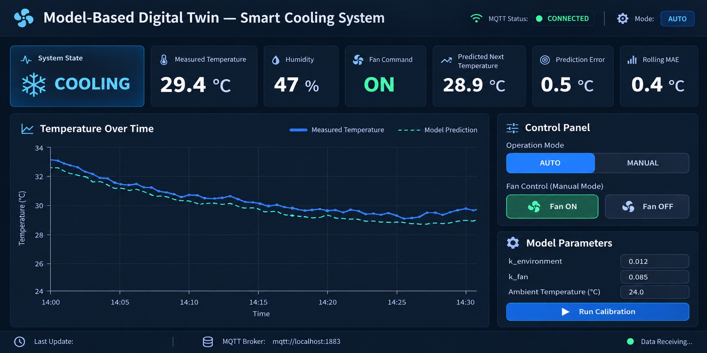

# Model-Based Digital Twin of a Smart Cooling System

A functioning Python application that synchronizes a simulated cooling system or ESP32 with a first-order thermal model over MQTT. A deterministic controller operates the fan. An autonomous supervisor diagnoses model drift, validates calibration candidates, applies improvements, and checks whether those improvements persist.

This is a practical Model-Based Systems Engineering (MBSE) and Digital Twin demonstrator. It combines a continuously updated physical state, an inspectable predictive model, measured prediction error, and a closed control loop. It runs entirely without hardware or an LLM.

## Quick start — Python 3.11+

Run from this repository's root directory:

```bash
python3.11 -m venv .venv
source .venv/bin/activate
pip install -e '.[dev]'
cp .env.example .env
```

With Docker Desktop running:

```bash
docker compose up -d
python -m simulator.physical_system
```

In two more terminals, activate the same environment and run:

```bash
python -m smart_cooling_twin
streamlit run dashboard/app.py --server.address=127.0.0.1 --server.headless=true
```

Open [the dashboard](http://localhost:8501). First telemetry normally arrives within a few seconds. The controller starts with a 100% fallback until fresh valid telemetry arrives. Start **one** twin and **one** simulator or physical device per configured device ID. All processes must share the same `DATABASE_PATH` and environment.

### One-command demonstration

```bash
python scripts/run_demo.py --local-broker --port 18883
```

This launches a development MQTT broker, simulator, twin, and dashboard. It requires the `dev` dependencies but no Docker. Ctrl-C stops the child processes. Without `--local-broker`, it uses an existing broker on `--port` (default 1883).

The demo increases heat at 90 seconds, reduces fan effectiveness at 180 seconds, and varies ambient temperature to make the parameters observable. Watch temperature, MAE, and the Agent timeline over several minutes. Calibration can be rejected when the history mixes disturbances; later attempts use newer data after a 180-second cooldown. Sensor noise makes exact timing variable. The accelerated integration test verifies the complete acceptance and verification sequence reproducibly.

For interactive disturbances, launch the simulator **without `--demo`** and use the dashboard sidebar. Demo mode owns its scheduled heat, ambient, and fan-effectiveness changes.

## Hosted deployment

A complete Docker deployment with persistent history, a private internal MQTT broker and a password-protected dashboard is included. See [deployment instructions](docs/DEPLOYMENT.md) for Render or your own Docker server. GitHub Pages cannot run this Python/MQTT stack.

## Implemented capabilities

- MQTT telemetry, status and expiring commands; reconnect and resubscribe after broker loss.
- Validated temperatures, humidity, actuator values, timestamps, device identity, and sensor health.
- OFF, NORMAL, HEATING, COOLING, OVERHEATING and FAULT states with hysteresis.
- AUTO proportional cooling and MANUAL fan demand with hard safety overrides.
- Two-second predictions, timestamp association, residuals, absolute error and a 30-sample rolling MAE.
- Bounded least-squares parameter estimation with chronological holdout validation.
- Autonomous OBSERVE → ASSESS → DECIDE → ACT → VERIFY → RECORD supervision.
- Persistent decisions, calibration cooldown, deduplicated alerts, rollback parameters and pending verification.
- Live Streamlit overview, charts, agent timeline, controls, simulation disturbances and recent-history export.
- SQLite telemetry, matched predictions, agent events, calibrations, alerts and runtime settings.
- ESP32/DHT22 firmware with MQTT, PWM, local safety fallback, reconnect and command watchdog.
- Optional provider-neutral diagnostic interface isolated from control.

## Architecture



The agent never publishes fan commands. Its requests must pass the allowed-action policy and safety checks. Model changes affect diagnostics and forecasts; actuator demand comes only from the deterministic controller and always passes the final safety clamp.

## Model, prediction and calibration

```text
dT/dt = k_heat + k_ambient * (T_ambient - T) - k_fan * fan_speed / 100
T_next = T + dt * dT/dt
```

Temperature is °C, time is seconds, `k_heat` and `k_fan` are °C/s, and `k_ambient` is 1/s. Integration uses Euler steps of at most one second. Default parameters are `0.12`, `0.012`, and `0.25` respectively.

Every accepted measurement produces a forecast two seconds ahead using the just-issued command and constant ambient temperature. A later sample within 0.5 seconds of the target is matched; missing or late samples are not treated as prediction errors. Residual = measured − predicted. MAE is the mean of the last 30 absolute residuals.

Calibration needs at least 60 usable intervals and fan variation of at least 15 percentage points in the training data. It fits the last 120 intervals, uses the first 70% to train and the final 30% to validate, and accepts only a bounded candidate with at least 15% lower holdout MAE. `k_ambient` is held fixed when its independent variation is not identifiable. Parameter bounds are `k_heat: [0,2]`, `k_ambient: [0.0001,0.2]`, `k_fan: [0.001,3]`.

The supervisor runs every 10 seconds. Three degraded assessments with rolling MAE above 0.06 °C trigger a calibration attempt, subject to device health and a 180-second cooldown. On 30 fresh intervals, the candidate must remain at least 5% better than the previous model or it is rolled back. Verification times out after 180 seconds without sufficient data. Alert evidence and decisions are stored as concise operational records, not hidden reasoning.

## Control and safety defaults

| Condition | Behavior |
|---|---|
| NORMAL / HEATING / OFF, AUTO | 0% fan demand |
| COOLING, AUTO | `20 + 20 × (temperature − setpoint)`, clamped to 0–100% |
| MANUAL | Requested percentage, subject to all safety checks |
| ≥40 °C or FAULT | 100% cooling overrides manual demand |
| Cooling / overheating exit | 1 °C hysteresis |
| Dashboard setpoint | 20–35 °C |
| Missing valid telemetry | FAULT after 10 seconds by default |
| MQTT disconnected | Immediate runtime FAULT once disconnect is detected |
| Invalid sensor / jump >2 °C/s | FAULT and alert |
| Device command missing or expired | Local 100% fallback within five seconds |

Commands are refreshed every second and expire after five seconds. Duplicate/out-of-order telemetry cannot refresh the watchdog. The model supervisor cannot alter the hard temperature limit. A fan commanded on with warming and positive residual bias produces a diagnostic warning; this is evidence of possible fan degradation or extra heat, not proof of mechanical failure.

## Hardware

The intended prototype uses an ESP32, DHT22, a logic-level MOSFET and a 5 V fan. Drive the fan through a suitable power stage, with a common ground; never power it from a GPIO. GPIO 4 is the default sensor input and GPIO 18 is the PWM output. The firmware uses Arduino-ESP32 3.x.

See [firmware setup and limitations](firmware/README.md). Set `SIMULATION_MODE=false`, stop the simulator, configure the ESP32's ignored `config.h`, and run the same twin and dashboard. The ESP32 uses the [same MQTT contract](docs/MQTT.md). Its ambient value is a configured estimate unless a second sensor is added.

The supplied Mosquitto configuration is an anonymous **loopback-only development broker**. For an ESP32 on the LAN, configure a reachable broker with authentication and appropriate network restrictions; set matching environment and firmware credentials. Python supports TLS using the system CA store. The supplied Arduino sketch uses plain MQTT and therefore requires a trusted isolated LAN broker. Credentials belong only in `.env` and `firmware/smart_cooling/config.h`, both ignored by Git.

## Optional LLM role

`LLM_ENABLED=false` is the default and the complete application works without any key or provider. `LLMReasoner` accepts an injected `DiagnosticProvider`, validates its summary and possible causes, and returns no diagnostic if disabled. No provider is bundled and the runtime does not issue external LLM requests. The flag is reserved for applications injecting such a provider; setting it alone does not enable an integration. Provider responses cannot set PWM, publish MQTT, execute code, or change safety limits.

## Tests and quality checks

```bash
pytest -q
ruff check src simulator dashboard tests scripts
ruff format --check src simulator dashboard tests scripts
```

The test suite includes equations, validation, state transitions, hysteresis, controller safety, prediction matching, calibration excitation and holdout checks, autonomous degradation recovery, persistent cooldown, alert deduplication, and real TCP MQTT broker restart. MQTT tests launch their own loopback AMQTT broker on an unused port. Docker and hardware are not needed. CI runs the suite on Python 3.11 and 3.12.

## Repository map

```text
src/smart_cooling_twin/  Domain, model, control, calibration, agent, persistence, MQTT runtime
simulator/               Physical device substitute
dashboard/app.py         Streamlit presentation and settings forms
firmware/                ESP32 sketch and local configuration example
scripts/                 Demo launcher and development test broker
tests/                   Unit, integration and dashboard checks
docs/                    Requirements, architecture, MQTT and original concept
mosquitto/               Development broker configuration
data/                    Local SQLite history (ignored)
```

The original design README is preserved at [docs/ORIGINAL_DESIGN.md](docs/ORIGINAL_DESIGN.md), and the original dashboard image is preserved below. It was moved to avoid a case-insensitive filename conflict with `dashboard/`.



## Limitations and future work

This is a single-device educational prototype, not a certified thermal safety system. The linear model omits thermal masses, nonlinear airflow, actuator lag and power measurements. A constant cooling term may predict below ambient; do not interpret such forecasts as physical guarantees. Fan telemetry reports applied PWM, not measured RPM. The model assumes approximately constant fan demand over each sampling interval. A disturbance changing during calibration can lead to rejection or later rollback.

SQLite history grows until archived by the operator; backup the database using SQLite's backup API. The dashboard and runtime are intended for one trusted local host; dashboard authentication and multi-device routing are future work. Hardware-in-the-loop measurements, fan tachometry, measured ambient temperature, richer heat-transfer models and parameter uncertainty are useful next steps.

See [validation results](docs/VALIDATION.md), [requirements](docs/REQUIREMENTS.md), [architecture](docs/ARCHITECTURE.md), and [MQTT contract](docs/MQTT.md).
