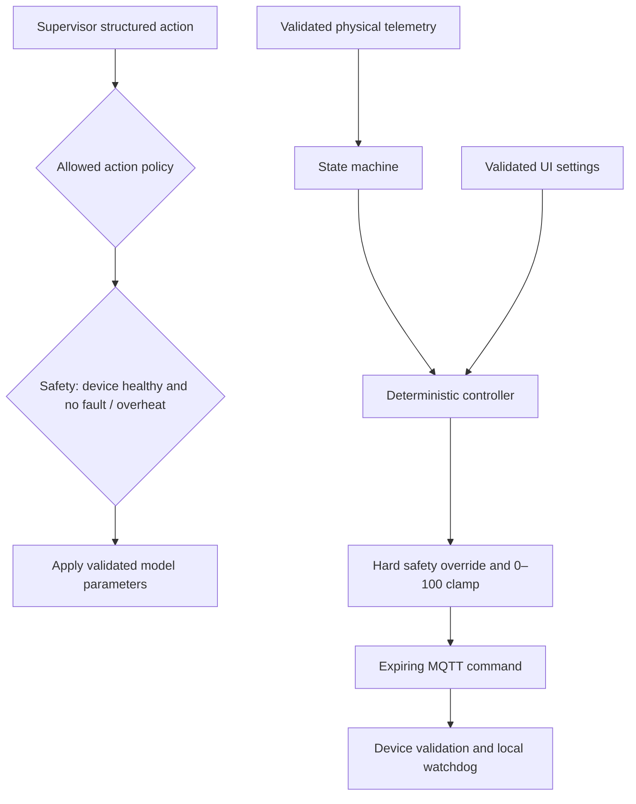
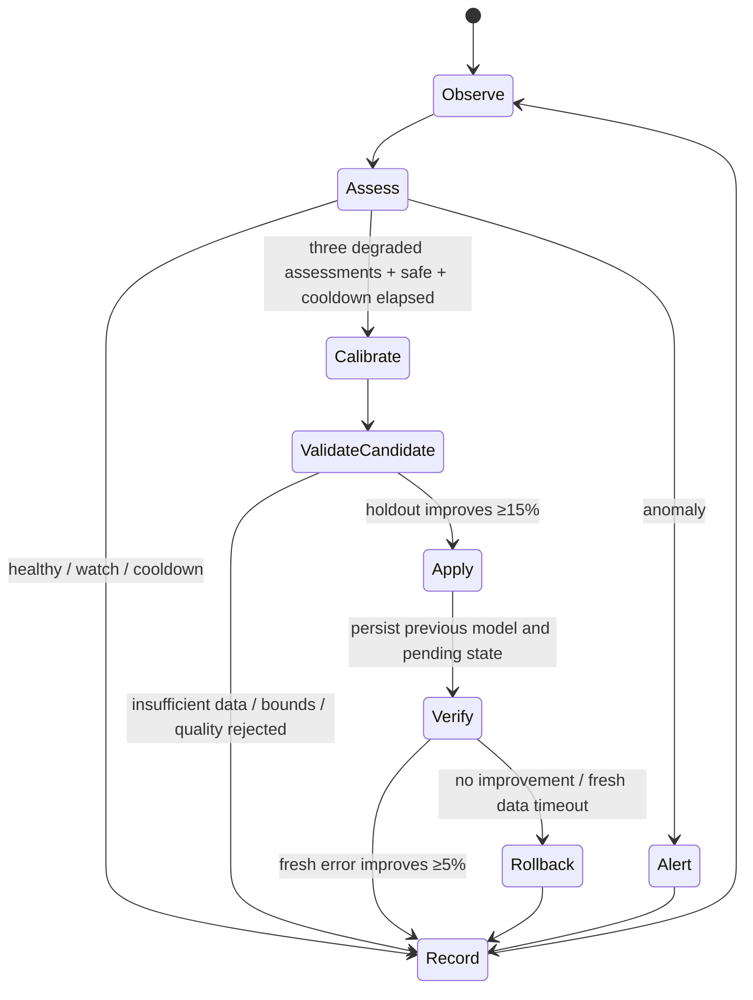

# Architecture and engineering decisions

## Module boundaries

| Module | Responsibility |
|---|---|
| `models` | Pydantic domain and wire validation; finite bounded physical values |
| `mqtt` | Bounded queues, reconnect, subscriptions, serialization |
| `__main__` | Service loop, settings, decoding, health/watchdogs and publishing |
| `twin` | Synchronization and coordination of the components |
| `control` | State transitions, deterministic fan demand and immutable hard limits |
| `thermal` | First-order Euler integration and forecasts |
| `validation` | Rolling residuals and MAE |
| `calibration` | Excitation checks, least squares, holdout comparison and bounds |
| `agent` | Autonomous diagnostics, allowed tools, verification and persistent memory |
| `repository` | SQLite queries and record serialization |
| `llm` | Optional diagnostic provider protocol, without action authority |

Each process opens its own SQLite connection. Paho's networking thread never touches the database. SQLite WAL and a ten-second busy timeout permit dashboard reads alongside runtime writes. UI logic contains no SQL. Runtime history is bounded to 600 measurements and 60 pending predictions. Persistent history is intentionally retained until the operator archives it.

## Control ownership

The supervisor's allowed actions are NONE, CALIBRATE, APPLY, ROLLBACK, ALERT and FORECAST. Calibration/application are denied while health is unknown, disconnected, faulted or overheating. Rollback may restore known previous parameters during faults. No supervisor or LLM tool exposes a fan setter or MQTT client. The deterministic controller is independent of fitted model coefficients, so a poor fit cannot increase actuator authority. The hard limit is a frozen `SafetyLimits` record and is not exposed as a dashboard setting.

## State machine

Fault checks precede overheating, overheating precedes OFF, and cooling thresholds precede heating-trend classification. OVERHEATING holds until at or below 39 °C; COOLING holds until at or below setpoint −1 °C. HEATING enters at a rise above 0.02 °C/s and remains above 0.005 °C/s. Fresh validated measurements recover faults. AUTO OFF means zero normal demand, but an unsafe temperature still overrides it.

## Prediction and validation

Predictions are generated at measurement time for a fixed two-second target and match later observations within 0.5 s. The UI displays pending prediction and the latest matched error separately. Only matched pairs are stored in the predictions table. A dropped sample expires its pending prediction without adding a residual. Parameter changes clear outstanding predictions and the rolling window so models are not mixed.

Calibration uses observed interval derivatives. Sampling intervals must be 0.2–3 seconds. It excludes explicit sensor faults, power-off samples and device mismatches. Full-rank, reasonably conditioned data permit all three coefficients to be fitted. Otherwise `k_ambient` is held fixed and heating/fan coefficients are fitted if fan excitation is sufficient. Out-of-bound unconstrained solutions are rejected rather than projected into an apparently successful fit. Validation is chronological and disjoint from fitting.

## Agent lifecycle

Events expose evidence, decisions and expected/actual outcomes. The supervisor checks device and MQTT health, trend, residual bias, commanded cooling response, calibration age, recent actions and active alerts. Persistent cooldown prevents repeated attempts after restart. Active alert codes deduplicate repeated observations and resolve on recovery. A pending verification survives restart; the agent collects new healthy data before verifying or rolls back on timeout. Agent disabling is configured through `AGENT_ENABLED`.

## Defaults and limits

The first-order approximation is intentionally modest: it is useful for visible feedback, drift detection and parameter estimation, not a high-fidelity thermodynamic claim. Sensor noise, timing jitter and actuator changes inside a measurement interval affect residuals. Fan-effectiveness alerts identify hypotheses, not causal proof. A second ambient sensor and tachometer would substantially improve observability.

The LLM provider interface can supply validated human-readable diagnostics in an embedding application. It is not wired to the default runtime and no provider or external network request is needed. The supervisor itself is deterministic autonomous software.

## Original design

The original README and dashboard concept are preserved under `docs/ORIGINAL_DESIGN.md` and `docs/assets/dashboard-concept.jpg`. The implemented UI follows its overview, temperature comparison, control and parameter panels, with added health, error history and agent timeline views.
